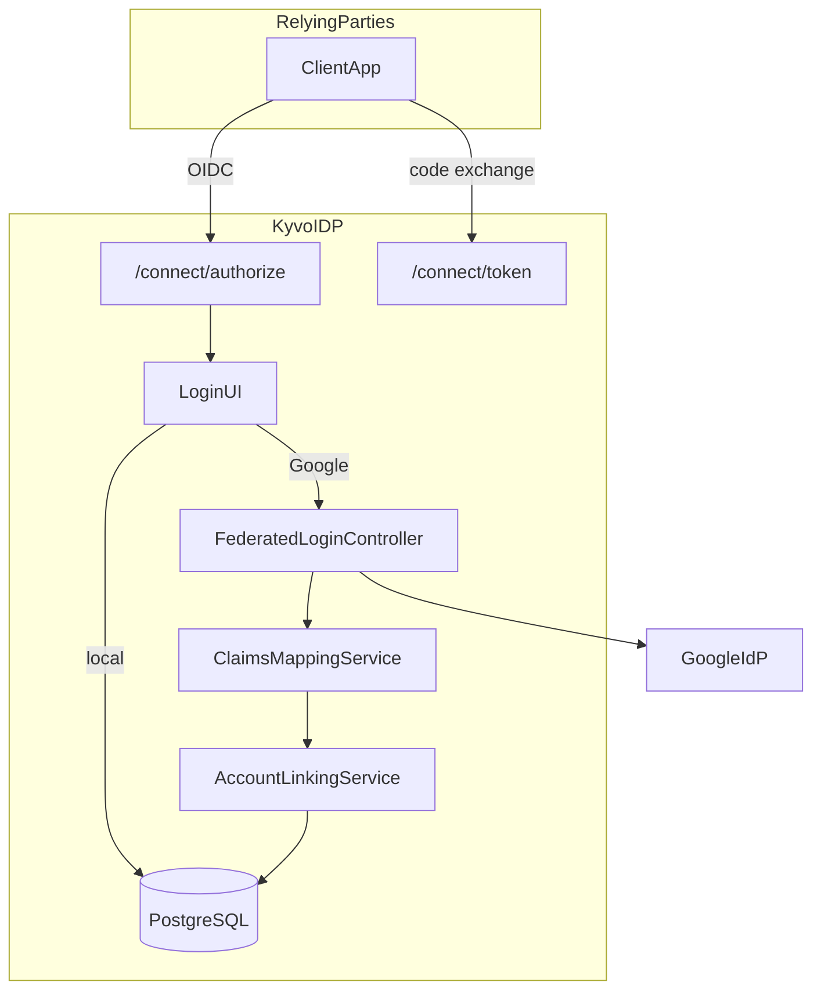
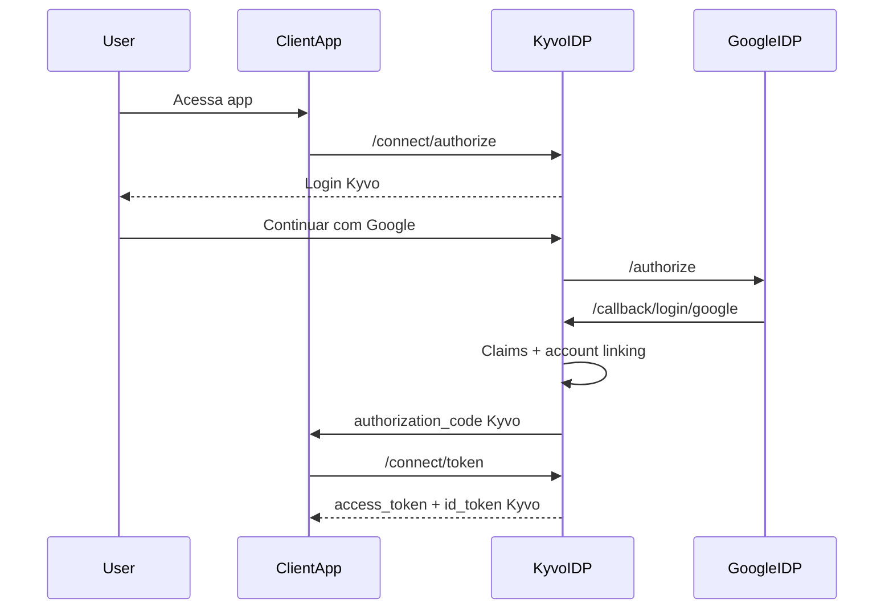

# Kyvo IDP

Identity Provider / Identity Broker puro (OpenID Connect + OAuth 2.0). Sem multi-tenancy.

## Arquitetura



### Fluxo federado Google



## Projetos

| Projeto | Papel |
|---------|--------|
| `Kyvo.IDP.Domain` | Contratos de domínio (reservado; identidade vive em Identity) |
| `Kyvo.IDP.Application` | Use cases, opções, interfaces de claims/linking |
| `Kyvo.IDP.Infrastructure` | EF Core, Identity, OpenIddict, implementações |
| `Kyvo.IDP.API` | Host, controllers OIDC, Blazor login/consent |

Escopo detalhado: [SCOPE.md](SCOPE.md). Segurança: [SECURITY.md](SECURITY.md). Testes E2E: [docs/E2E.md](docs/E2E.md).

## Pré-requisitos

- .NET 8 SDK
- PostgreSQL 16 (ou Docker)

## Subir com Docker Compose

```bash
cd idp
docker compose up --build
```

API em `http://localhost:5101`, Postgres em `localhost:5433`.

## Desenvolvimento local

```bash
# Terminal 1 — Postgres
docker compose up postgres

# Terminal 2 — API
cd idp
dotnet ef database update --project Kyvo.IDP.Infrastructure --startup-project Kyvo.IDP.API
dotnet run --project Kyvo.IDP.API --launch-profile https
```

- HTTPS: `https://localhost:5101`
- Health: `https://localhost:5101/health`
- Discovery: `https://localhost:5101/.well-known/openid-configuration`
- Login: `https://localhost:5101/account/login`

Usuário seed (dev): `admin@kyvo.local` / `ChangeMe!123`

## Segredos Google (User Secrets)

```bash
cd Kyvo.IDP.API
dotnet user-secrets set "Google:ClientId" "<client-id>.apps.googleusercontent.com"
dotnet user-secrets set "Google:ClientSecret" "<client-secret>"
```

No Google Cloud Console, configure o redirect URI:

`https://localhost:5101/callback/login/google`

## Client OAuth seed

- `client_id`: `kyvo-idp-spa` (público, PKCE obrigatório)
- Redirects: `https://localhost:3000/callback`, Postman `https://oauth.pstmn.io/v1/callback`

### Teste Authorization Code + PKCE (resumo)

1. Gere `code_verifier` / `code_challenge` (S256).
2. Abra:

```
https://localhost:5101/connect/authorize?client_id=kyvo-idp-spa&response_type=code&scope=openid%20profile%20email%20offline_access&redirect_uri=https://oauth.pstmn.io/v1/callback&code_challenge=<CHALLENGE>&code_challenge_method=S256
```

3. Faça login local (ou Google), aceite o consentimento.
4. Troque o `code` em `POST /connect/token` (grant `authorization_code` + `code_verifier`).
5. Valide `GET /connect/userinfo` com o access token.
6. Renove com `refresh_token`; revogue em `POST /connect/revoke`.

## Segurança

- HTTPS obrigatório no host Kestrel (perfil `https`).
- Cookies de sessão: `Secure`, `HttpOnly`, `SameSite=Lax`.
- Segredos via User Secrets / variáveis de ambiente — nunca commitados.
- Produção: defina `Oidc:SigningCertificatePath` (+ password) com certificado real; considere Azure Key Vault.
- Não desabilite validações do OpenIddict.

## O que este serviço não inclui

Multi-tenancy, dual-token, admin SPA, SDKs, MFA, SAML, SCIM, Firebase.
